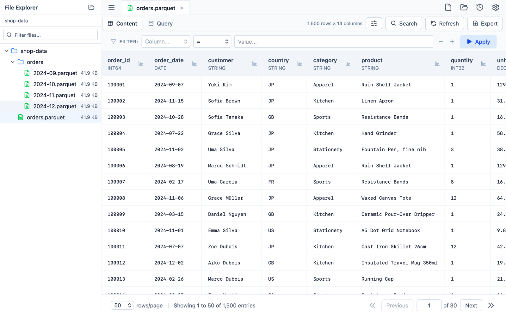

# Parqsee

A fast, native viewer for [Apache Parquet](https://parquet.apache.org/) files
on macOS. Open a file, page through the rows, filter and search them, run SQL
over the file, export what you found — on your machine, with no notebook, no
cluster and no upload.

**[parqsee site](https://parqsee.fuji.llc/)** ·
[Privacy](https://parqsee.fuji.llc/privacy.html) ·
[Support](https://parqsee.fuji.llc/support.html)



- **Fast on large files** — a Rust backend on Arrow and Parquet reads a page by
  skipping the row groups before it, so tens of millions of rows page as
  quickly as a small file.
- **Real types** — every column shows its Parquet type; decimals, 64-bit
  integers and non-finite floats are rendered as stored, not rounded through a
  JavaScript number.
- **Filter and search** — conditions over any column, or a search across the
  page you are looking at. Adding a filter never reorders the rows.
- **SQL over the file** — the open file is table `t`; run a read-only
  DataFusion query and read the result in the same grid.
- **Export** — the whole file, the current page or the filtered rows to CSV or
  JSON, streamed at constant memory.
- **Tabs and a file explorer** — open a folder and browse its Parquet files;
  the open tabs come back at the next launch with their page and filter.
- **Opens from Finder** — double-click a `.parquet` file, or drop it on the
  window or the Dock icon.
- **Dark mode, English and Japanese**, following the system appearance.
- **Offline by construction** — no network requests, no account, no telemetry.

## Install

Parqsee is coming to the Mac App Store; until then, build it from source (see
[Development](#development)). It requires **macOS 12 or later** and runs on
Apple silicon and Intel.

On the App Store it is free to download, with at most **3 files open at a
time**; everything else — paging, filters, search, the SQL view, export — has
no limit. A one-time in-app purchase removes the tab limit for good. There is
no subscription and no license key.

## Usage

### Opening files

- Drag a `.parquet` file onto the window, or double-click one in Finder.
- ⌘O opens the file dialog, ⇧⌘O opens a folder in the explorer sidebar.
- Recent files are on the start screen; so is a bundled sample file, for when
  you have no Parquet file at hand.

### Around the window

- **File explorer** — toggle the sidebar with the hamburger menu (☰); the tree
  is bounded by the folders you opened.
- **Tabs** — one file per tab; ⌘W closes the active one.
- **Content / Query** — the grid and the SQL view over the same file.
- **Search** — ⌘F searches the page in view and highlights the hits.
- **English and Japanese** — the app starts in your system's language and
  Settings switches it, the menu bar included.

### Keyboard shortcuts

Every shortcut is in the menu bar, and ⌘/ (Help › Keyboard Shortcuts)
shows them all on one sheet.

| | |
|---|---|
| ⌘O | Open a file |
| ⇧⌘O | Open a folder in the explorer |
| ⌘, | Settings |
| ⌘W | Close the current tab |
| ⇧⌘T | Reopen the last closed tab |
| ⇧⌘] / ⇧⌘[ | Next / previous tab (also ⌥⌘→ / ⌥⌘←) |
| ⌘1 … ⌘9 | Go to tab 1 to 9 |
| ⌘B | Show or hide the sidebar |
| ⌘E | Switch between Content and Query |
| ⌘F | Search within the page |
| ⌘G / ⇧⌘G | Next / previous match (Enter / ⇧Enter in the search box) |
| ⌘↩ | Run the query |
| ⌘/ | Keyboard shortcuts |
| Esc | Close the search bar or a dialog |

## Development

### Prerequisites

- [Node.js](https://nodejs.org/) 18 or later
- [pnpm](https://pnpm.io/) — `npm install -g pnpm`
- [Rust](https://rustup.rs/), latest stable —
  `curl --proto '=https' --tlsv1.2 -sSf https://sh.rustup.rs | sh`

### Run it

```bash
git clone https://github.com/k0kishima/parqsee.git
cd parqsee/frontend
pnpm install
pnpm tauri dev
```

There is no root `package.json`: every npm script lives in `frontend/`, and
the Rust side is `backend/` (its build artifacts land in `backend/target`, not
`src-tauri`).

### Building

```bash
cd frontend
pnpm build         # the frontend alone
pnpm tauri build   # -> backend/target/release/bundle/macos/Parqsee.app
```

`pnpm tauri build` produces the `.app` only; `pnpm tauri build --bundles dmg`
makes a disk image for direct distribution.

The Mac App Store submission is `scripts/release/appstore.sh`: it builds the
store variant (`pnpm tauri:store`, StoreKit linked) as a universal binary —
run `rustup target add x86_64-apple-darwin` once — signs it with the Mac App
Store profile and the Apple Distribution identity from the `APPLE_*` variables
in its header, wraps it into a `.pkg` with `productbuild`, and with `--upload`
validates and uploads it through `xcrun altool`.
`scripts/release/appstore.sh --unsigned` makes the same package without any
certificate, for a look at what the store gets.

### Tests

```bash
cd frontend && pnpm test        # Vitest
cd backend  && cargo test --lib # Rust unit tests
```

`scripts/qa/e2e/` drives the real backend through Playwright WebKit (see its
README), `docs/MANUAL_QA.md` holds what only the macOS shell can show, and
`site/` is the product page published to GitHub Pages.

## How it is put together

- `frontend/` — React 18 + TypeScript + Tailwind v4 on Vite, one folder per
  feature under `src/features/` (welcome, workspace, file-explorer,
  file-viewer, query, layout, settings, license).
- `backend/` — Tauri v2 and Rust: Arrow / Parquet and DataFusion behind
  `src/commands/` and `src/services/`. All file I/O lives here; the webview
  never touches the filesystem.
- `scripts/` — the sample-file generator, the release and QA scripts, and the
  end-to-end harness.
- `site/` — the product page published to GitHub Pages.

`CLAUDE.md` in the repository root is the maintained description of the
architecture: the Tauri command table, the caching and paging design, the
sandbox and bookmark rules, the free tier, and what each test suite covers.
Read it before changing the backend.

## Troubleshooting

### Common Issues

1. **Port 1420 already in use**
   - Another instance is already running
   - Kill the process or restart your terminal

2. **Rust compilation errors**
   - Make sure you have the latest Rust version: `rustup update`
   - Clear Cargo cache: `cargo clean` (inside `backend` directory)

3. **File not opening**
   - Ensure the file has a `.parquet` extension
   - Check file permissions, and — on a sandboxed build — that the file was
     opened or its folder added rather than reached by path
   - The error shown is the one the Parquet reader returned; a file that fails
     here is worth filing

### Performance Tips

- A release build is the one to judge speed by: `pnpm tauri dev` is a debug
  build and scans roughly twenty times slower.
- An unfiltered page is read by skipping row groups; a filter turns the page
  into a DataFusion query, so a filter over a huge file is the slow case.
- Close tabs you are done with: each one keeps a session and the file's
  metadata cached.

## Contributing

1. Fork the repository
2. Create a feature branch: `git checkout -b feature-name`
3. Make your changes
4. Test thoroughly
5. Submit a pull request

## License

This project is licensed under the MIT License.

## Recommended IDE Setup

- [VS Code](https://code.visualstudio.com/) + [Tauri](https://marketplace.visualstudio.com/items?itemName=tauri-apps.tauri-vscode) + [rust-analyzer](https://marketplace.visualstudio.com/items?itemName=rust-lang.rust-analyzer)